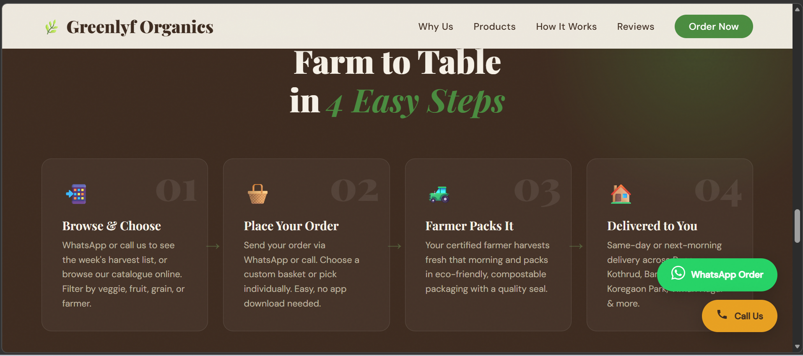
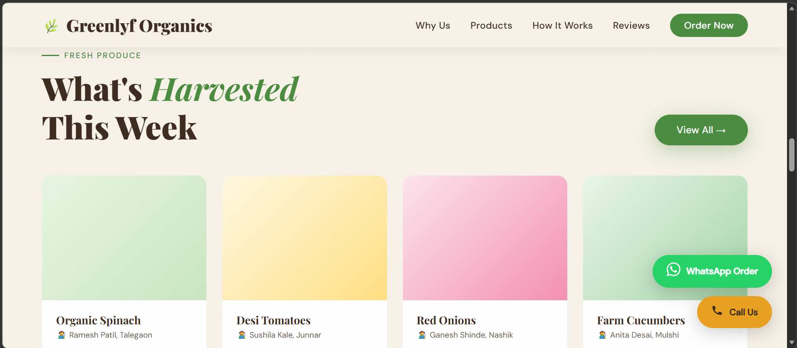
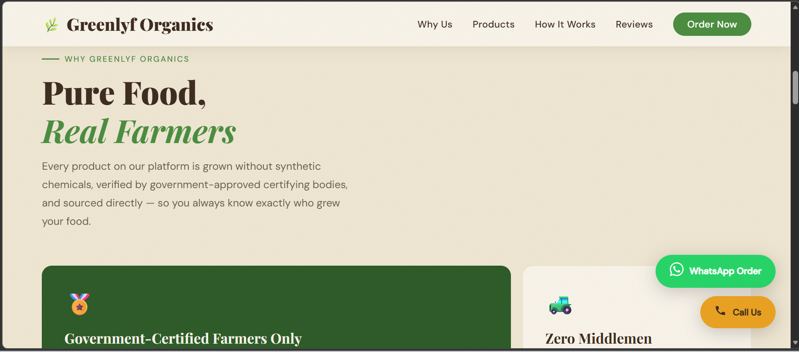
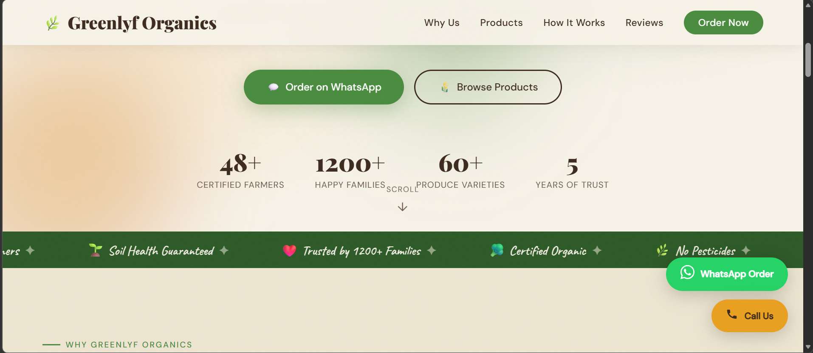
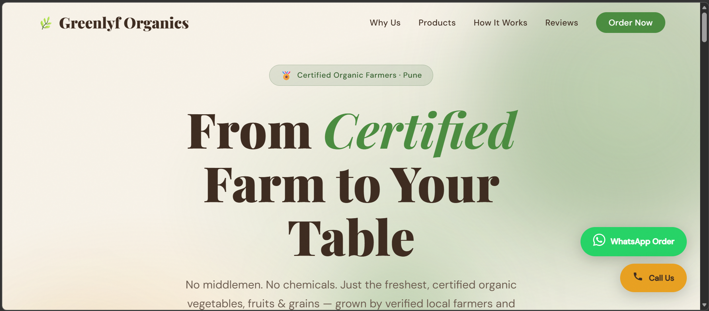
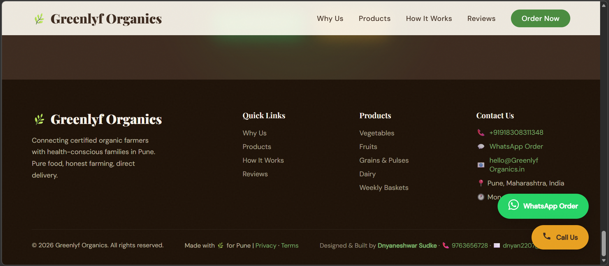

# 🌿 Greenlyf Organics Website

A modern responsive landing page for an organic farming business.

## 🚀 Live Demo
👉 http://www.greenlyfeorganics.com

## 💡 Features
- Clean UI/UX design
- Mobile responsive
- Smooth animations
- Modern CSS (gradients, glass effect)
- SEO optimized meta tags
- Interactive elements (hover, scroll, counters)

## 🛠️ Tech Stack
- HTML5
- CSS3
- JavaScript (Vanilla)

## 📸 Screenshots

## 🎯 Purpose
Built as a real-world business landing page to demonstrate frontend skills.
